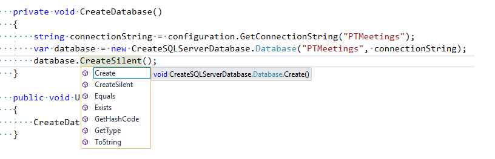

<!--Category:C#,SQL--> 
 <p align="right">
    <a href="https://www.nuget.org/packages/ProductivityTools.CreateSQLServerDatabase/"></a>
    <a href="http://productivitytools.tech/productivitytools-createsqlserverdatabase/"><a> 
    <a href="https://github.com/pwujczyk/ProductivityTools.CreateSQLServerDatabase"></a>
</p>
<p align="center">
    <a href="https://www.powershellgallery.com/packages/ProductivityTools.PSSetLockScreen/">
        
    </a>
</p>


# ProductivityTools.CreateSQLServerDatabase

Creates database on SQL Server. Used often before DBUp migrations.

<!--more-->

Library allow us to create database from code.
Database object exposes three methods:

* Create – it creates database. If database exists throws exception
* CreateSilent – it creates database, but before creation it checks if database exists. When true do nothing.
* Exists – checks if database exists

During creation of database connection string cannot contain database name so library removes it from the connection string if provided. From connection string:

```
"Server=.\\sql2019;Database=PTMeetings;Integrated Security=True"
````
Library will make and use

```
"Server=.\\sql2019;Integrated Security=True"
```

**Database** object implement **IDatabase** interface, so you can inject it or use it in tests if required. 

## Usage example:

```c#
Database database = new Database(name, "Server=.\\SQL2019;Trusted_Connection=True;");
database.Create();
```


